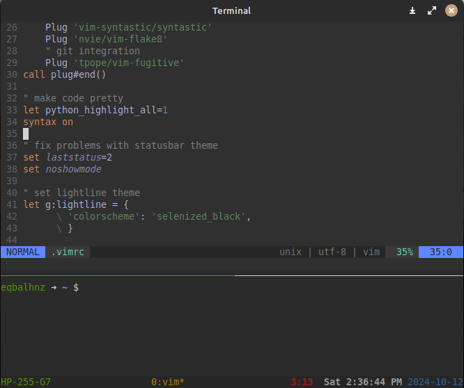

# My Dotfiles

<p align="justify">This repository contains my personal configuration files (dotfiles) for Vim, Tmux, and Bash. These configurations are minimal and simple. I avoid changing default keybindings or adding extra tools like file browsers and fuzzy search tools. The goal is to keep things clean, efficient, and as close to the default experience as possible.</p>

<div align="center">
  
</div>

#### Dotfiles Included

- `.vimrc`: Configuration file for [Vim](https://www.vim.org/)
- `.tmux.conf`: Configuration file for [Tmux](https://github.com/tmux/tmux/wiki)
- `.bashrc`: Configuration file for [Bash](https://www.gnu.org/software/bash/)

**Note:** These instructions are written as if I'm talking to myself. If you're browsing this repo, feel free to use and customize the configuration files to your liking, but be aware that some content may not be tailored for a wider audience.

---

### Prerequisites

Before running the installation script, ensure that the following are installed:

- **curl** and **git**
- **Node.js** (version 16.18.0 or higher) for [CoC.nvim](https://github.com/neoclide/coc.nvim). You can install Node.js by following the instructions [here](https://github.com/nodesource/distributions/blob/master/README.md).
- **Oh My Bash**, which you can install using this command:

   ```bash
   bash -c "$(curl -fsSL https://raw.githubusercontent.com/ohmybash/oh-my-bash/master/tools/install.sh)"

### Installation

1. **Clone the repository and navigate to the dotfiles directory**:

   ```bash
   git clone https://github.com/PyZulfiqar/dotfiles.git ~/dotfiles && cd ~/dotfiles
2. **Run the install script**:

   ```bash
   ./install.sh
   ```
    This will symlink the configuration files to your home directory.

### Post-Installation Steps

- [Vim-Plug](https://github.com/junegunn/vim-plug) will be installed automatically. After launching Vim, just run:

   ```vim
   :PlugInstall

- CoC.nvim will be installed after running the above command, use the command `:CocInstall` to install its extensions 

   ```vim
    :CocInstall coc-html coc-css coc-tsserver coc-json coc-python